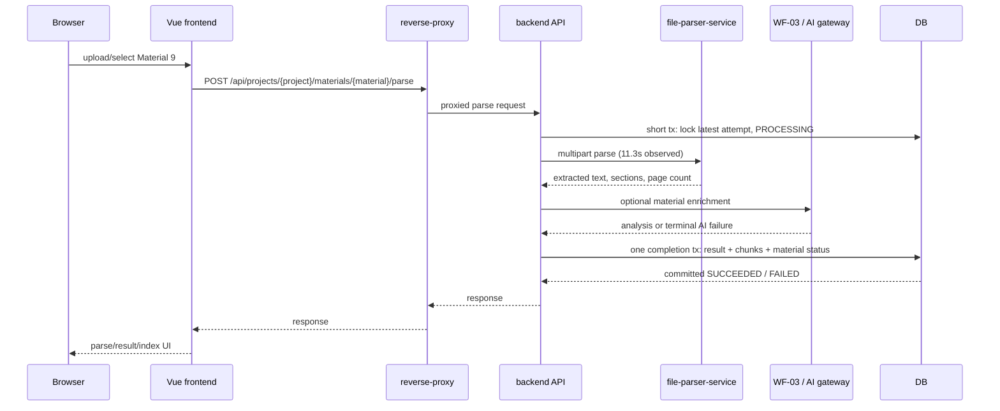

# Material 9 Browser E2E Evidence

This note records the observed synchronous path and the failure boundaries for
Project 7 / Summary / Material 9. It preserves the existing Kimi split:
workflow backend calls use the `.cn` endpoint and the PPT harness uses `.ai`.

## Failure findings

- First parse: the observed parser duration was about 11.3s while the backend
  remote parser client default was 10s. The client cancelled before a parser
  response, and the previous code converted that interruption into a generic
  failed result. The default is now 30s and the failure reason is persisted.
- HTTP 499: 499 is an Nginx client-closed-request signal, not a parser success
  or a database state. In this path it is consistent with the upstream request
  being cancelled while the synchronous parser call was still running. The
  proxy read/send windows remain 300s; no endpoint was changed.
- PROCESSING: the old attempt was written before network work, but an aborted
  request had no finally transition. Recovery now converts an inactive
  PROCESSING attempt to FAILED in its own transaction; retry then reuses the
  same attempt and is guarded by a database lock.
- Chunk atomicity: completion marks the parse provisional, indexes chunks, and
  commits the parse result, material status, and chunk replacement together.
  Index failure rolls the completion transaction back, leaving prior chunks
  intact; the separate failure transaction records FAILED.

## Browser acceptance path

After Material 9 reaches `SUCCEEDED` and its index count is non-zero, continue:

`TeachingIntent generate -> confirm -> GenerationPlan generate -> confirm ->
single PPT generate -> task/status -> Artifact/Version -> download/open`.

The PPT generation path remains job-based in the frontend and uses the existing
status polling contract. A live provider run requires configured credentials;
tests must fail closed when the provider is unavailable rather than report a
successful AI metric.
