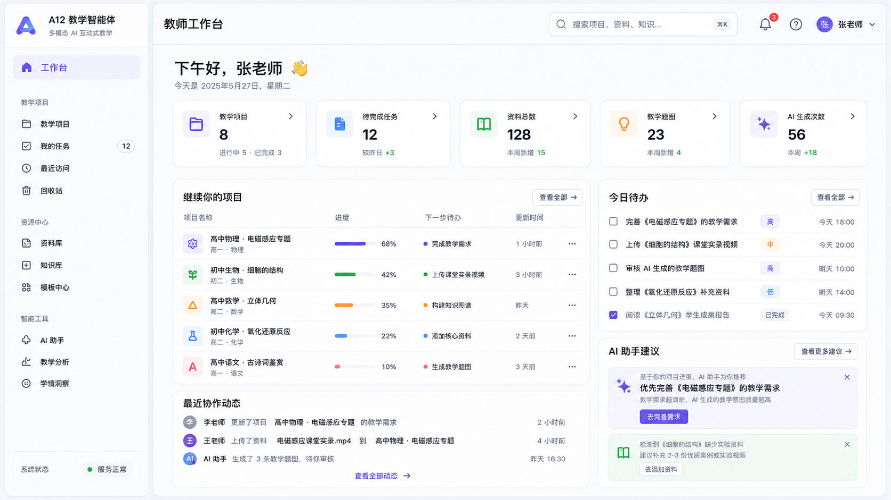
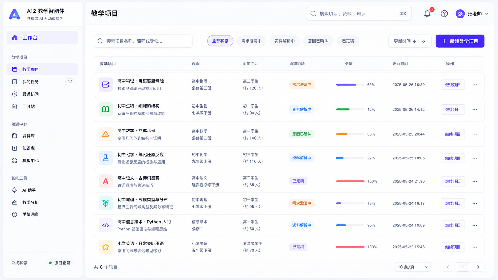
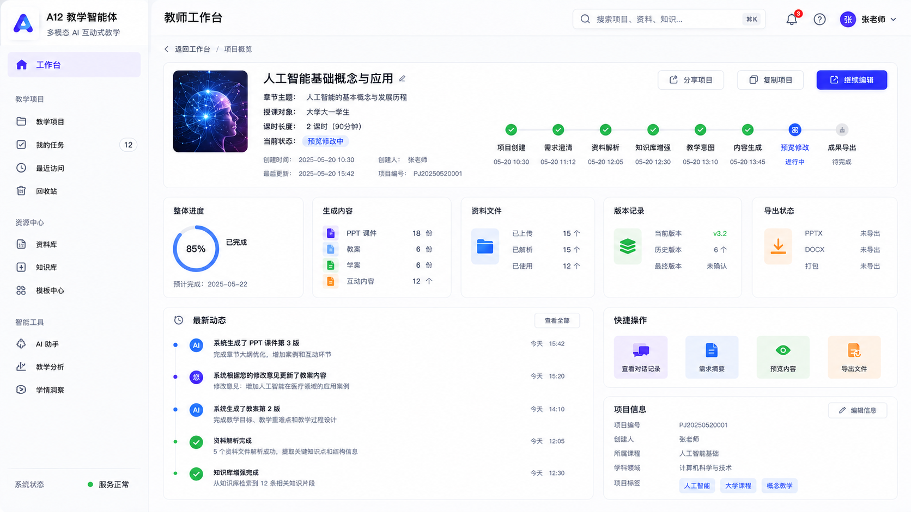
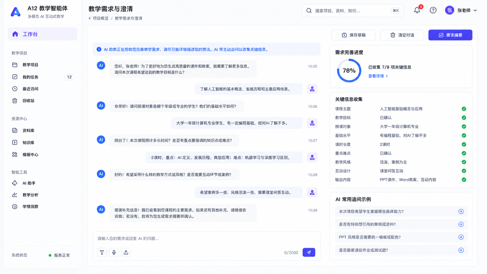
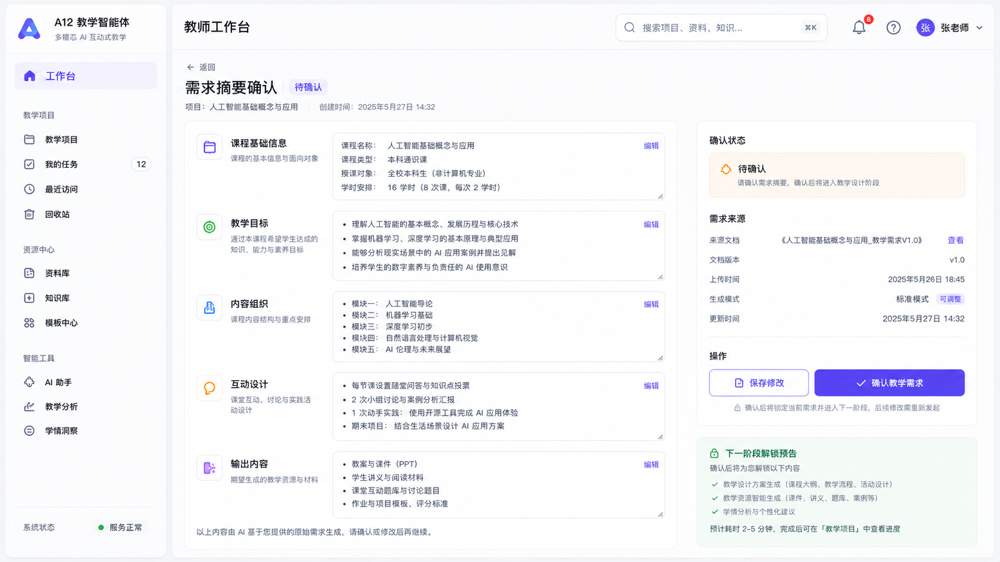
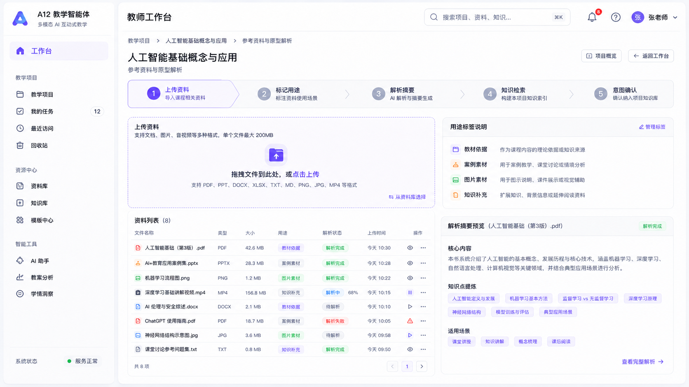
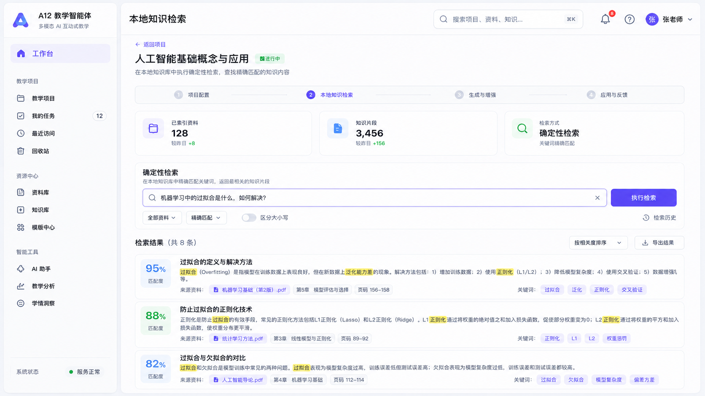
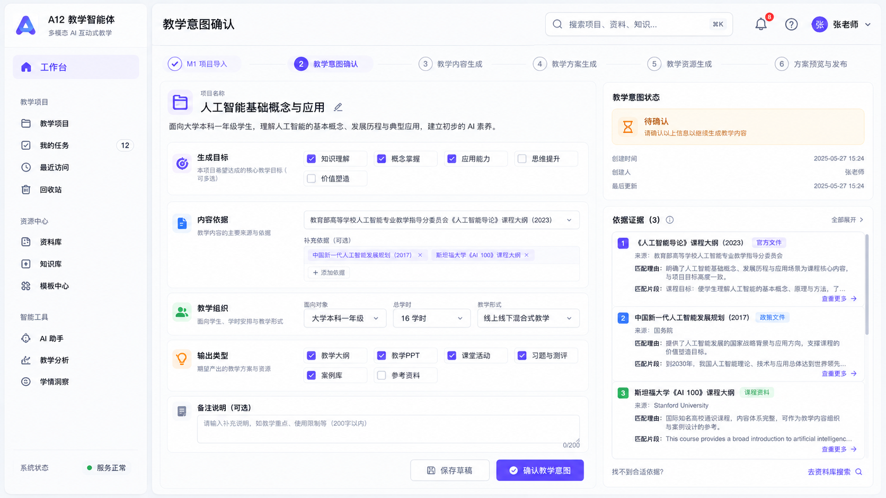

# 多模态 AI 互动式教学智能体
# 用户界面设计说明书 V6.0

> 浅色产品工作区高保真实施版
> 适用范围：当前 M1/M2 核心页面、后续前端产品化重构与比赛演示
> 日期：2026-07-12

---

## 文档修订记录

| 版本 | 日期 | 修订说明 |
|---|---|---|
| V1.0–V1.1 | 2026-07-07 | 形成以线性演示流程为核心的用户界面设计基线。 |
| V2.0–V3.0 | 2026-07-10 至 2026-07-11 | 将界面从演示型向项目工作区和商业产品体验调整。 |
| V4.0–V5.0 | 2026-07-12 | 试验浅色、深色视觉方向，并明确浅色版为当前开发基准。 |
| **V6.0** | **2026-07-12** | **以八张统一浅色高保真页面为核心，重写产品壳层、页面结构、状态、数据真实性、接口映射和实施验收规则。** |

---

## V6.0 实施裁决

以下文字规则优先于高保真图中的局部生成误差：

1. 每个页面只允许一个全局导航项处于选中状态。
2. 顶部页面标题必须跟随当前路由，不使用跨页面的固定标题。
3. 浅色产品工作区是本版唯一实施基准；图中的示例数据不得硬编码。
4. 尚未实现的 M3/M4 入口必须隐藏或明确禁用，不得伪造页面、数量或操作结果。

---

# 1. 文档目的与设计结论

## 1.1 编写目的

本文档用于把已经确认的浅色高保真界面转化为可直接指导 Vue 3、TypeScript 与 Element Plus 前端开发的页面规范。文档不再只描述“界面应该高级、简洁、产品化”，而是明确统一壳层、页面构图、内容层级、业务状态、真实数据边界、交互规则和实施顺序。

## 1.2 当前设计结论

当前前端采用**浅色产品工作区**作为唯一实施方向。整体风格使用冷白灰页面背景、白色内容面板、细边框、低饱和功能色、紧凑表格和克制阴影，形成教师长期使用的 SaaS 工作台，而不是官网、比赛大屏或传统后台模板。

当前阶段不实现深色模式，不加入液体动画和大面积玻璃效果。深色主题只保留为后续可选扩展，不影响本版页面结构。

## 1.3 本版覆盖范围

本版高保真页面覆盖：

| 序号 | 页面 | 当前阶段 |
|---:|---|---|
| 1 | 教师工作台 | PR1 / 已有基础 |
| 2 | 教学项目列表 | PR1 / 已有基础 |
| 3 | 项目概览 | PR1 / 已有基础 |
| 4 | 教学需求与智能澄清 | M1 / 已有功能 |
| 5 | 需求摘要确认 | M1 / 已有功能 |
| 6 | 参考资料与解析工作台 | M2 / 已有功能 |
| 7 | 本地知识检索 | M2 / 已有功能 |
| 8 | 教学意图确认 | M2 / 已有功能 |

内容生成、预览修改、版本管理和成果导出属于 M3/M4。高保真图中出现的未来入口只用于表达产品演进方向，当前开发不得为了匹配图片而构造空页面或虚假数据。

---

# 2. 设计依据与约束

## 2.1 业务依据

系统围绕“创建项目—输入需求—智能澄清—摘要确认—资料上传与解析—知识检索—教学意图确认—后续内容生成与导出”的教师备课闭环设计。项目是所有需求、对话、资料、知识片段和教学意图的业务容器。

## 2.2 工程依据

前端通过 Spring Boot 后端访问项目、需求、对话、资料、解析结果、知识检索和教学意图数据。前端不得直接调用 Dify，也不得在页面中伪造服务状态。当前后端能力、接口契约和状态模型优先于设计稿中的示例数据。

## 2.3 高保真图使用原则

八张高保真图用于确定：

1. 统一产品壳层；
2. 页面信息密度；
3. 组件层级和空间分配；
4. 状态标签与主次操作；
5. 教师工作流的视觉连续性。

图中项目数量、通知数量、日期、进度百分比、AI 次数、协作记录和未来功能属于示例，不得直接硬编码。

---

# 3. 产品信息架构

## 3.1 全局层

当前全局导航建议收敛为：

| 一级入口 | 当前处理 |
|---|---|
| 教师工作台 | 始终显示 |
| 教学项目 | 始终显示 |
| 资源与知识库 | 显示已实现入口，可拆分为参考资料和知识库 |
| 系统设置 | 保留轻量入口 |
| 我的任务、最近访问、回收站 | 暂不实现，除非已有真实路由和数据 |
| 模板中心、AI 助手、教学分析、学情洞察 | 当前隐藏 |
| 内容生成、预览、成果导出 | 在项目内部后续阶段开放，不作为当前全局入口 |

## 3.2 项目层

项目内部使用稳定的二级导航：

| 项目模块 | 页面职责 |
|---|---|
| 概览 | 显示项目摘要、下一任务、阶段状态和数据摘要 |
| 教学需求 | 输入需求、AI 澄清和摘要确认 |
| 参考资料 | 上传、用途绑定、解析状态和解析摘要 |
| 知识库 | 检索知识片段并查看来源 |
| 教学意图 | 编辑并确认教学目标、内容依据、教学组织和输出类型 |
| 内容生成 | M3 开放 |
| 预览与修改 | M3/M4 开放 |
| 版本与导出 | M3/M4 开放 |

## 3.3 导航边界

全局侧边栏回答“教师正在使用哪个工作区”；项目二级导航回答“当前项目正在处理哪个业务对象”。M1/M2 步骤条只可作为局部辅助，不得再形成第三套大导航。

---

# 4. 统一产品壳层

## 4.1 页面尺寸与栅格

| 区域 | 桌面基准 |
|---|---|
| 设计画布 | 1440px–1664px 宽桌面视图 |
| 全局侧边栏 | 224px–240px |
| 顶部栏 | 60px–64px |
| 页面外边距 | 24px；超宽屏 28px–32px |
| 工作区最大宽度 | 1440px–1520px |
| 普通卡片圆角 | 10px–12px |
| 普通卡片间距 | 16px |
| 表格行高 | 48px–52px |
| 按钮高度 | 次按钮 36px，主按钮 40px |
| 输入框高度 | 36px–40px |
| 详情面板 | 420px–560px，视业务复杂度调整 |

## 4.2 左侧导航

左侧导航在所有页面中必须保持相同的品牌区域、宽度、图标尺寸、分组方式和底部状态区。页面切换只能改变选中项，不得改变导航入口名称和顺序。

统一规则如下：

| 元素 | 规范 |
|---|---|
| 品牌 | A12 教学智能体或最终产品名称，副标题保持一行 |
| 选中态 | 淡紫蓝背景、蓝紫文字或左侧细线 |
| 导航项 | 高度 42px–44px，图标约 18px |
| 分组标题 | 12px 弱文本 |
| 底部状态 | 只展示真实健康检查结果 |
| 用户信息 | 姓名、角色、头像，数据不可用时使用中性占位 |
| 未实现入口 | 默认隐藏，不得可点击进入空页面 |

## 4.3 顶部栏

顶部栏在全部页面中保持统一：

1. 左侧显示当前页面标题；
2. 中部或右侧显示全局搜索；
3. 右侧保留通知、帮助和用户菜单；
4. 教师工作台和项目列表可显示“新建教学项目”主按钮；
5. 项目内部页面不重复显示全局主按钮；
6. 通知数量必须来自真实数据，否则不显示数字。

## 4.4 项目上下文

项目内部页面在顶部栏下方显示项目名称、课程或章节、当前状态、最近更新时间和返回项目入口。项目上下文应稳定存在，避免教师在需求、资料、知识库和教学意图之间切换时失去项目位置感。

---

# 5. 视觉系统

## 5.1 颜色令牌

```css
--ui-canvas: #f4f7fb;
--ui-panel: #ffffff;
--ui-panel-subtle: #f8fafd;
--ui-border: #e3e9f1;
--ui-border-strong: #d7e0eb;

--ui-text-primary: #182235;
--ui-text-secondary: #65738a;
--ui-text-tertiary: #8b98aa;

--ui-primary: #5b45f6;
--ui-primary-hover: #4934e8;
--ui-primary-soft: #f0edff;

--ui-info: #3f7df6;
--ui-success: #23b26d;
--ui-warning: #f29b38;
--ui-danger: #e65b64;
--ui-ai: #7357e8;
```

## 5.2 背景、边框与阴影

页面背景使用冷白灰，不允许纯白铺满。内容面板使用白色，并通过 1px 边框与轻阴影形成层级。

```css
box-shadow: 0 6px 20px rgba(23, 43, 77, 0.06);
```

重点面板最多使用：

```css
box-shadow: 0 10px 28px rgba(23, 43, 77, 0.08);
```

禁止多层发光、强烈渐变、霓虹外发光和大面积毛玻璃。

## 5.3 字体层级

| 层级 | 建议 |
|---|---|
| 页面标题 | 24px–28px，600–700 |
| 区块标题 | 16px–18px，600 |
| 核心数字 | 28px–34px，600–700 |
| 正文 | 14px / 22px |
| 辅助信息 | 12px–13px / 20px |
| 按钮 | 14px，500–600 |

## 5.4 状态语言

状态必须同时使用文案、颜色和图标，不仅依赖颜色。

| 语义 | 颜色 | 示例 |
|---|---|---|
| 当前/信息 | 蓝色 | 资料解析中、当前阶段 |
| 成功 | 绿色 | 已确认、解析完成、服务正常 |
| 提醒 | 橙色 | 待确认、用途未绑定 |
| 错误 | 红色 | 解析失败、请求失败 |
| AI 辅助 | 紫色 | AI 澄清、AI 建议、智能提取 |

---

# 6. 页面一：教师工作台



## 6.1 页面定位

教师工作台是登录后的首屏，目标是在五秒内帮助教师确定：最近要继续哪个项目、下一步需要做什么，以及如何创建新项目。

## 6.2 页面结构

| 区域 | 设计要求 |
|---|---|
| 问候区 | 显示教师姓名和真实日期；姓名不可用时显示“教师工作台” |
| 指标区 | 最多四个真实指标，不显示无法计算的同比或成功率 |
| 继续项目 | 展示最近项目、当前阶段、下一任务和继续入口 |
| 今日待办 | 由真实项目状态派生，不伪造截止时间 |
| 最近项目 | 高密度列表或表格，一屏显示 4–6 条 |
| AI 建议 | 只根据真实缺失项生成；无可靠数据时隐藏 |
| 系统状态 | 移到侧边栏底部，使用真实健康接口 |

## 6.3 数据真实性

图中的项目数、AI 生成次数、协作动态和具体时间只表示布局。当前开发优先展示项目数量、进行中项目、资料数量和已确认教学意图等可由现有接口计算的数据。

## 6.4 关键交互

点击继续项目进入项目概览；点击待办进入对应业务页面；点击最近项目整行进入项目概览；点击新建项目进入项目创建流程。

---

# 7. 页面二：教学项目列表



## 7.1 页面定位

项目列表是教师管理全部备课项目的高密度工作区，承担搜索、筛选、排序和继续项目，不再使用大面积项目卡片。

## 7.2 表格字段

| 字段 | 说明 |
|---|---|
| 项目名称 | 名称 + 课程或章节辅助信息 |
| 课程 | 课程名称、学段或教材信息 |
| 面向受众 | 授课对象 |
| 当前阶段 | 使用真实项目状态转为教师语言 |
| 进度 | 只有存在可靠计算方式时显示 |
| 更新时间 | 默认倒序 |
| 操作 | 继续项目 + 更多菜单 |

## 7.3 工具栏

工具栏包含搜索、状态筛选、更新时间排序和新建项目。当前数据量较小时允许前端筛选；后续数据扩大后切换后端分页。

## 7.4 移动端

宽度小于 768px 时改为紧凑项目卡片。卡片必须复用同一数据与状态映射，不重新设计一套业务逻辑。

---

# 8. 页面三：项目概览



## 8.1 页面定位

项目概览回答三个问题：项目当前处于什么阶段、下一步应该做什么、已经积累了哪些需求、资料、知识和教学意图数据。

## 8.2 当前阶段布局

当前 M1/M2 实施只保留：

| 区域 | 当前实现 |
|---|---|
| 项目摘要 | 项目名称、课程、章节、对象、课时、模式、更新时间 |
| 下一任务 | 依据真实状态生成唯一主操作 |
| 阶段任务 | 教学需求、参考资料、知识库、教学意图 |
| 数据摘要 | 资料数、解析成功数、知识片段数、意图状态 |
| 局部错误 | 某个辅助接口失败时仅影响对应区块 |

高保真图中的生成内容、版本记录、导出状态和完整流程时间线属于未来 M3/M4，当前必须隐藏或显示明确的“尚未开放”，不得生成虚假数量和版本。

## 8.3 状态规则

上传资料不等于资料完成。只有至少一份资料解析成功，资料阶段才能标为完成。知识片段为零与接口失败必须区分。教学意图草稿与已确认必须区分。

---

# 9. 页面四：教学需求与智能澄清



## 9.1 页面定位

该页面是智能体体验的核心，用于保存教师原始需求、展示 AI 主动追问、收集回答并实时呈现需求完整度。

## 9.2 页面构图

| 区域 | 比例与职责 |
|---|---|
| 对话主区 | 约 65%–70%，展示 AI 与教师对话 |
| 需求状态侧栏 | 约 30%–35%，展示已收集字段与缺失字段 |
| 输入区 | 固定在对话区底部，支持长文本、快捷回答和提交 |
| 顶部操作 | 保存草稿、清空对话、进入需求摘要 |

## 9.3 交互规则

AI 只追问缺失字段，避免重复提问。教师修改前文回答后，以最新确认内容为准。清空对话属于高风险操作，必须二次确认。未满足摘要条件时，需求摘要按钮应提示缺失项，而不是直接进入下一步。

## 9.4 页面一致性

侧边栏必须与工作台、项目列表和项目概览使用同一全局导航。项目内部导航不得替换全局导航，只在内容区顶部或项目上下文条中出现。

---

# 10. 页面五：需求摘要确认



## 10.1 页面定位

需求摘要确认页是 M1 的关键控制节点，用于让教师检查系统理解的最终需求，并决定是否进入资料与知识增强阶段。

## 10.2 信息分组

| 分组 | 内容 |
|---|---|
| 课程基础信息 | 课程、章节、受众、课时、模式 |
| 教学目标 | 知识、能力、素养目标 |
| 内容组织 | 知识点、章节结构、重点难点 |
| 互动设计 | 课堂问答、练习、案例和活动 |
| 输出内容 | 当前阶段需要的教学资源类型 |
| 确认状态 | 待确认、已确认、需要修改 |

## 10.3 编辑方式

当前字段支持就地编辑或抽屉编辑。每次修改后必须保存并重新确认。确认后锁定需求摘要；需要修改时执行“解锁修改”，不能直接静默覆盖已确认数据。

## 10.4 当前边界

图中“下一阶段解锁预告”只作为解释，不应承诺尚未实现的教学方案、学情分析或资源生成能力。

---

# 11. 页面六：参考资料与解析工作台



## 11.1 页面定位

资料模块采用“上传区 + 高密度资料列表 + 解析详情”同屏工作区，避免上传、用途绑定和解析结果被拆成多个演示页面。

## 11.2 页面结构

| 区域 | 设计要求 |
|---|---|
| 上传区域 | 支持拖拽和点击上传，显示格式与大小约束 |
| 资料列表 | 文件名、类型、大小、用途、解析状态、时间和操作 |
| 用途说明 | 解释教材依据、案例素材、图片素材和知识补充等语义 |
| 解析详情 | 显示核心摘要、知识点、适用场景和失败原因 |
| 行操作 | 查看、绑定用途、开始解析、重新解析、删除 |

## 11.3 状态语义

| 状态 | 页面文案 |
|---|---|
| PENDING | 待解析 |
| PARSING | 解析中 |
| SUCCEEDED / COMPLETED | 解析完成 |
| FAILED | 解析失败 |
| 用途为空 | 待确认用途 |

## 11.4 当前约束

当前实现不得展示未经后端支持的实时百分比和跨格式智能提取结果。图片、视频、PPT 等格式若仍为 Mock，应明确标识原型状态。

---

# 12. 页面七：本地知识检索



## 12.1 页面定位

知识库页面用于检索与当前项目相关的知识片段、查看来源和证据，并决定是否采用，不应设计成技术参数控制台。

## 12.2 页面结构

| 区域 | 设计要求 |
|---|---|
| 项目上下文 | 项目名称、检索状态和返回项目 |
| 检索摘要 | 已索引资料数、知识片段数、当前检索方式 |
| 搜索区 | 查询文本、来源筛选、执行检索 |
| 结果列表 | 匹配程度、标题、摘要、来源、关键词 |
| 详情 | 可在右侧面板或展开区域显示完整片段与引用位置 |

## 12.3 教师语言

普通教师不需要看到向量距离、Embedding、Top K 等底层术语。相关性可以显示“高、中、低”或弱化百分比；演示模式允许显示分数，但必须说明它是相关性估计。

## 12.4 异常与空状态

无匹配结果是正常业务状态，页面应允许调整关键词或继续流程；接口失败则显示重试入口，不能伪装为“0 条结果”。

---

# 13. 页面八：教学意图确认



## 13.1 页面定位

教学意图确认页将需求摘要、资料解析结果和知识片段融合为可确认的教学设计约束，是 M2 进入后续内容生成的控制节点。

## 13.2 页面构图

| 区域 | 设计要求 |
|---|---|
| 左侧编辑区 | 生成目标、内容依据、教学组织、输出类型和备注 |
| 右侧证据区 | 显示需求、资料和知识片段依据 |
| 顶部状态 | 草稿、证据不足、待确认、已确认 |
| 底部操作 | 保存草稿、确认教学意图 |

## 13.3 证据可解释性

每个主要教学意图字段应能够追溯到教师需求、参考资料或知识库片段。AI 建议必须说明依据，不能只给出无法解释的结论。

## 13.4 确认状态

已确认后页面进入只读或受控编辑状态。解锁修改必须清楚提示会影响后续内容生成。当前 M3 未实现时，确认后返回项目概览并显示下一阶段尚未开放。

---

# 14. 通用交互状态

所有核心页面必须覆盖以下状态：

| 状态 | 页面要求 |
|---|---|
| Loading | 使用局部骨架屏，不使用全页旋转 |
| Empty | 说明当前无数据并给出唯一下一步 |
| Error | 保留已加载内容，提供局部重试 |
| Saving | 显示保存中 |
| Saved | 轻量显示已保存时间 |
| Save failed | 保留用户输入并允许重试 |
| Processing | 显示任务名称和当前阶段 |
| Partial success | 明确成功项与失败项 |
| Confirmed | 显示确认状态、确认时间和修改入口 |
| Disabled | 说明禁用原因，不只降低透明度 |

---

# 15. Element Plus 去默认化

| 组件 | 规范 |
|---|---|
| `el-menu` | 弱背景、细选中态、统一图标尺寸，取消传统大色块后台感 |
| `el-table` | 表头约 42px、行高 48px–52px、弱横线和轻 hover |
| `el-card` | 减少使用；1px 边框、10px–12px 圆角、极轻阴影 |
| `el-button` | 主按钮 40px、次按钮 36px、8px 圆角，禁止胶囊形 |
| `el-tag` | 22px–24px 高、低饱和背景、状态语义统一 |
| `el-input` | 36px–40px 高，聚焦时蓝紫边框与轻外环 |
| `el-drawer` | 420px–560px，标题与底部操作固定 |
| `el-dialog` | 内容间距 20px–24px，减少默认空白 |

---

# 16. 响应式设计

| 宽度 | 策略 |
|---|---|
| ≥1440px | 保持完整侧边栏，主区和辅助区并列 |
| 1024px–1439px | 压缩辅助区和指标，隐藏次要字段 |
| 768px–1023px | 侧边栏可收起，右侧面板移动到主区下方 |
| <768px | 单列，侧边栏变抽屉，表格转卡片，详情面板全屏 |

移动端只调整布局，不得重新定义状态和业务逻辑。

---

# 17. 可访问性与性能

（一）图标按钮必须有可读名称；键盘焦点在浅色背景上清晰可见；状态不能只依赖颜色；输入框和对话区域支持键盘操作。

（二）前端不引入大型动画库。图片使用缩略图和懒加载；侧边栏、顶部栏和固定区域不得使用高成本模糊效果；页面数据避免重复请求。

---

# 18. 当前功能与未来功能边界

| 功能 | 当前处理 |
|---|---|
| 教师工作台、项目列表、项目概览 | 立即实施视觉统一 |
| 教学需求、澄清、需求摘要 | 保留 M1 业务，重构为统一工作区 |
| 资料、解析、知识库、教学意图 | 保留 M2 业务，重构为对象工作区 |
| 内容生成、预览、修改、版本、导出 | 仅预留信息架构，M3/M4 再实现 |
| 我的任务、协作动态、模板中心、教学分析 | 当前不实现 |
| 通知、AI 次数、同比、截止时间 | 无真实数据时不显示 |
| 深色模式 | 本版不实现 |

---

# 19. 推荐实施拆分

## 19.1 阶段一：设计与代码映射审查

由 Sol 只读审查当前仓库、路由、组件、接口和八张高保真图，形成实施计划，不修改代码。

## 19.2 阶段二：壳层与 PR1 页面

由 Terra 实现统一 tokens、侧边栏、顶部栏、教师工作台、项目列表和项目概览。

## 19.3 阶段三：M1 内容工作区

由 Terra 重构教学需求、智能澄清和需求摘要确认，保持接口与状态不变。

## 19.4 阶段四：M2 对象工作区

由 Terra 重构资料、知识检索和教学意图页面，保持现有 M2 契约。

## 19.5 阶段五：最小复验

由 Luna 执行前端构建、后端全量测试、静态检查和 PR 状态确认。项目负责人自行进行视觉体验，不要求自动截图。

---

# 20. 验收标准

1. 八个页面使用相同侧边栏、顶部栏、字体、色彩、圆角和边框。
2. 页面切换时导航入口和顺序不变化。
3. 浅色背景具有明确层级，不再是纯白页面。
4. 教师工作台首屏能找到继续项目、下一任务和新建项目。
5. 项目列表适合快速扫描，不是项目展示墙。
6. 项目概览只展示真实 M1/M2 数据，不伪造 M3/M4。
7. 教学需求、资料、知识库和教学意图呈现为连续工作区。
8. 未实现入口隐藏或明确禁用，不允许空页面。
9. 所有服务状态、任务数量、进度和时间来自真实数据。
10. 前端不修改后端接口契约。
11. 不新增第二套 UI 框架。
12. `npm run build` 通过。
13. 后端全量测试保持通过。
14. 1366px、1440px、1920px 和移动端无关键横向溢出。
15. 页面在人工体验中保持统一、克制、专业和可长期使用。

---

# 附录 A：高保真页面文件

| 编号 | 文件 |
|---:|---|
| 01 | `images/01-teacher-workspace.png` |
| 02 | `images/02-project-list.png` |
| 03 | `images/03-project-overview.png` |
| 04 | `images/04-requirement-clarification.png` |
| 05 | `images/05-requirement-summary.png` |
| 06 | `images/06-material-workspace.png` |
| 07 | `images/07-knowledge-retrieval.png` |
| 08 | `images/08-teaching-intent.png` |
